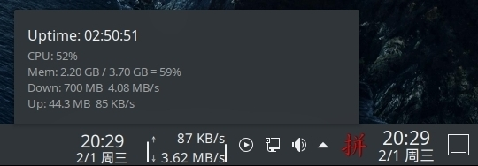

# CMDU for KDE Plasma

## Icon
Copy CMUD.png to ~/.local/share/icons/

## Reference 
https://develop.kde.org/docs/extend/plasma/widget/  
https://store.kde.org/p/998895 (https://github.com/dfaust/plasma-applet-netspeed-widget)  
[QML canvas](https://blog.csdn.net/qq_43248127/article/details/89402684)  
[CMDU_DDE_DOCK](https://github.com/sonichy/CMDU_DDE_DOCK)

## Problem
Netspeed for enp1s0 only