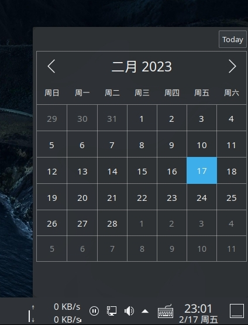

# KDE plasma widget: datetime

## Reference 
https://develop.kde.org/docs/extend/plasma/widget/  
/usr/share/plasma/plasmoids/org.kde.plasma.digitalclock/  
/usr/share/plasma/plasmoids/org.kde.plasma.calendar/    
[QML calendar](http://t.zoukankan.com/linuxAndMcu-p-13632176.html)